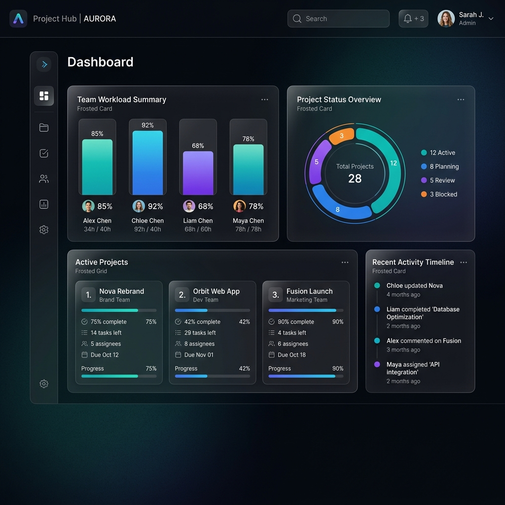
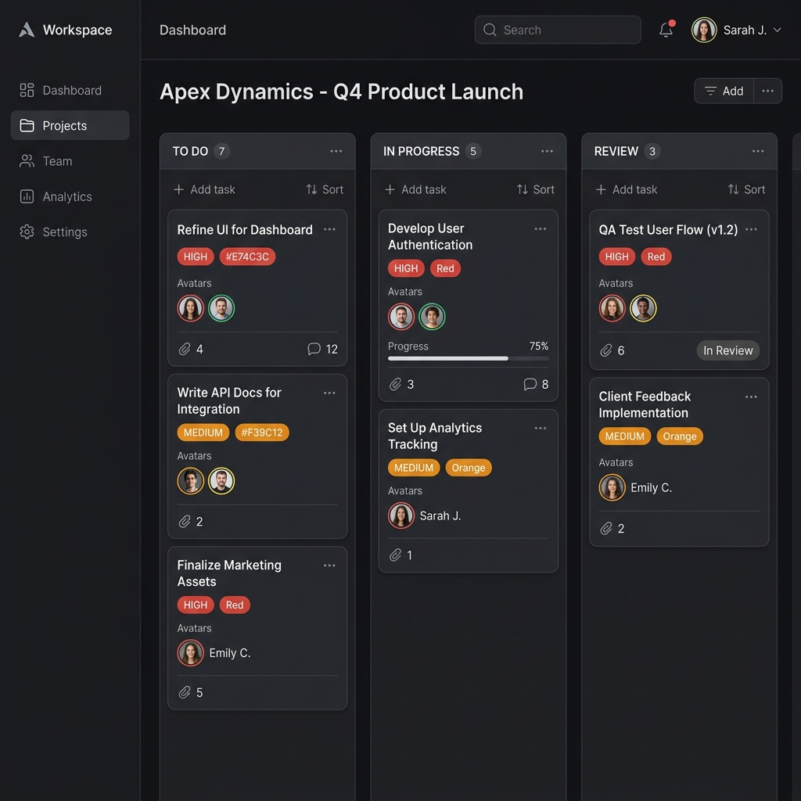
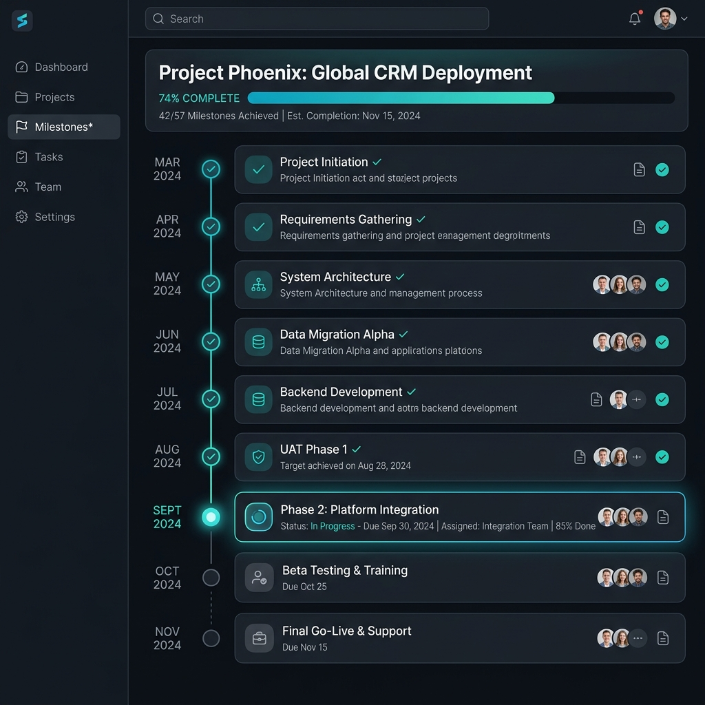
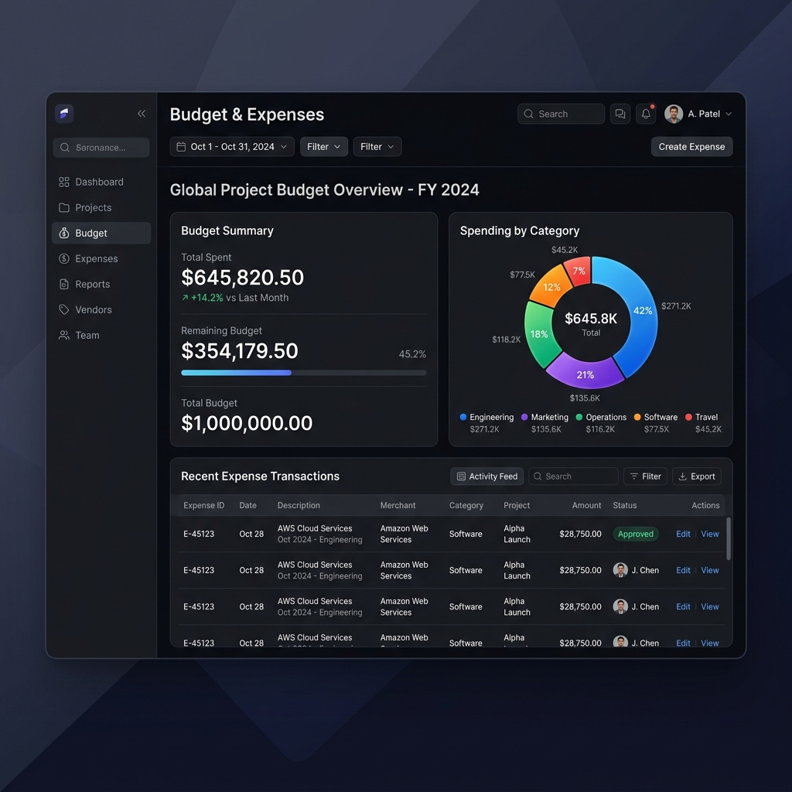

  
  # 🚀 ProFlow: Enterprise SaaS Project Management Platform

  **A production-ready, AI-enhanced task and project management ecosystem designed for modern enterprise teams.**

  
  
  
  
  
  
  

---

## 💼 Platform Overview

ProFlow is a comprehensive, enterprise-grade SaaS application engineered to streamline workflows, enhance team collaboration, and provide deep insights into project health. Built from the ground up with a focus on performance, security, and exceptional user experience, this platform demonstrates mastery of modern full-stack web development.

Moving beyond basic task managers, ProFlow incorporates sophisticated features essential for real-world enterprise environments, including real-time synchronization, advanced role-based access control (RBAC), multi-factor authentication (2FA), automated budget tracking, and AI-driven workflow suggestions.

---

## 📸 Platform Highlights

*Executive Dashboard: High-level overview of team workload, recent activity, and active project health metrics.*

*Interactive Kanban: Drag-and-drop workflow management with real-time synchronization.*

*Milestone Timeline: Track critical project phases, deadlines, and overall progress completion.*

*Financial Analytics: Categorized budget tracking and expense management for project lifecycle cost analysis.*

---

## 💎 Enterprise-Ready Features

### 🔐 Security & Authentication
- **Multi-Factor Authentication (2FA/TOTP):** Robust account security utilizing `otplib` and QR code generation for authenticator app integration.
- **NextAuth Integration:** Secure, session-based authentication supporting both email/password credentials and OAuth providers.
- **Role-Based Access Control (RBAC):** Granular permissions defining Owner, Admin, and Member capabilities across project scopes.

### 📊 Project & Financial Management
- **Budget & Expense Tracking:** Dedicated financial dashboards to monitor project spending, categorize expenses, and visualize budget consumption via interactive charts.
- **Milestone Management:** Strategic checkpoint tracking with progress visualizations, timeline views, and deadline monitoring.
- **Comprehensive Time Tracking:** Embedded task stopwatches and manual time logs to measure actual vs. estimated effort, automatically updating project analytics.

### ⚡ Real-Time Collaboration & Productivity
- **Live Sync Engine:** Leveraging Pusher for instant updates across Kanban boards, comments, and notifications without browser refreshes.
- **Interactive Kanban Boards:** Seamless Drag & Drop (via `dnd-kit`) supporting mouse, touch, and keyboard sensors for flawless mobile and desktop operation.
- **Workload Analytics:** Capacity planning algorithms that visually flag overloaded team members and distribute tasks efficiently.
- **AI-Powered Assistance:** Integration with AI endpoints to automatically suggest task breakdowns and subtasks based on context.

### 🎨 Architecture & UI/UX
- **Optimized Data Layer:** Prisma ORM communicating with a serverless Neon PostgreSQL database, utilizing PostgreSQL Full-Text Search for highly performant global queries.
- **Glassmorphic Design System:** A highly polished, responsive, and accessible UI crafted with Tailwind CSS and Framer Motion for buttery-smooth micro-interactions.
- **Type-Safe Full-Stack:** Strict TypeScript enforcement from database schema to React components, ensuring high reliability and zero-runtime-error deployments.

---

## 🛠️ Technical Stack

**Frontend:**
- **Framework:** Next.js 14 (App Router, Server Components)
- **Language:** TypeScript
- **Styling:** Tailwind CSS, Framer Motion (Animations), `dnd-kit` (Drag & Drop)
- **State Management:** Zustand
- **Components:** Radix UI (Headless accessibility primitives), Lucide React (Icons)

**Backend & Infrastructure:**
- **Database:** PostgreSQL (hosted on Neon)
- **ORM:** Prisma
- **Authentication:** NextAuth.js (v4), `otplib` (for 2FA)
- **Real-time:** Pusher (WebSockets)
- **Storage:** UploadThing
- **Deployment:** Vercel

---

  
Engineered with precision for production scale. Developed by a passionate Full-Stack Engineer.

